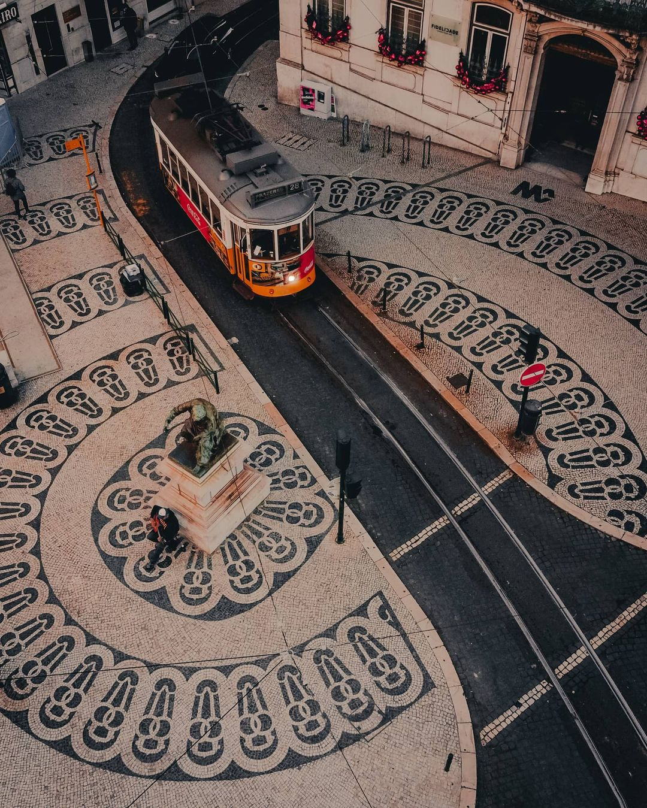
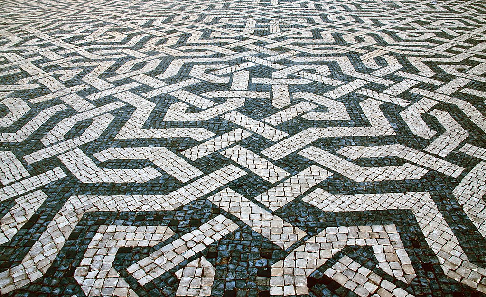

<p align="center">
<picture></picture>
<h2 align="center">Portuguese Iconography</h2>
<p align="center">
Portuguese Iconography (Iconografia Portuguesa) is a database designs and patterns that have shaped and been shaped by portuguese culture. The main purpose of this repository is to trace, catalogue and index them as well as to make this Iconography known to the world.</p>
</p>

<p align="center">
<a href="https://github.io/antonio-leitao/iconografia-portuguesa"></a>
</p>

# Calçada Portuguesa

</img>
Portuguese sidewalks, or _"calçadas"_, are not just functional walkways, but a unique art form that showcases the country's rich heritage. These intricate stone mosaics can be found in cities, towns and villages, each reflecting the culture and history of the region they are in. From geometric patterns to religious symbols, these sidewalks are a testament to the skill and precision of the artisans who created them, and a window into the culture and traditions of Portugal.

The traditional Portuguese sidewalk is made of small, flat stones, typically granite, and is laid out in a specific pattern. The work is done by skilled artisans _"calceteiros"_ who not only design the patterns but who cut and shape the stones, and then carefully lay them out to create the desired pattern. The Iconography used in these sidewalks is often influenced by the region in which they are located, and can include geometric shapes, religious symbols, architecture, and even scenes from local folklore and legends.

</img>

Today many of the traditional sidewalks have been lost to time and neglect. Most cities and towns have begun replacing the traditional sidewalks with modern concrete pavements, which are seen as more durable, easier to maintain and safer.

Even though the use of _"calçada portuguesa"_ is declining, the intricate iconography of these traditional sidewalks are an important part of the Portugal's cultural heritage. They are a unique and visually striking example of the country's history, art and culture, and should be preserved for future generations to appreciate.

# Contributing

Comtributions are more than welcome. There are many ways in which you can contribute, including:

1. Adding new SVGs.
2. Correcting exsiting SVGs.
3. Pointing out missing patterns

If you want to contribute, open a new issue and check the [contributing guidelines](./CONTRIBUTING.md).

You can always help by becoming a sponsor or starring this repository to make it known.

<!--
# Usage

```html
.svg"
/>
```
-->
